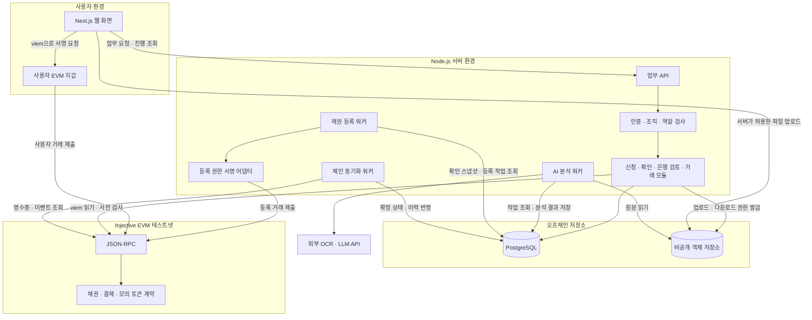
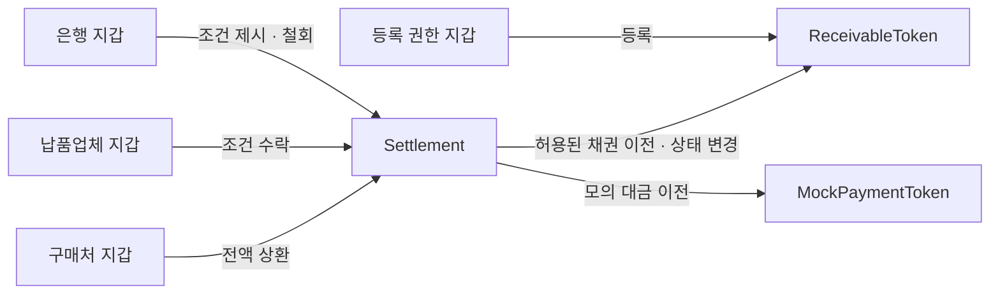
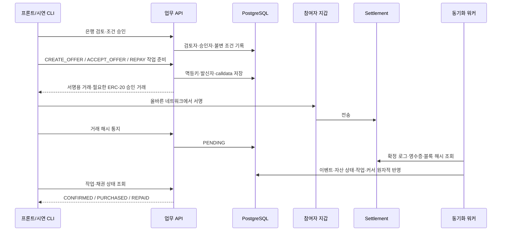

# PaidAhead 컴포넌트 구조 — v1 초안

작성일: 2026-09-19. 구현 전 개략 설계이며, 컴포넌트명과 디렉터리는 제안이다.

참고: [기능명세서](PaidAhead_기능명세서_v1.md), [제안 요약서·기술 스택](proposal_digest.md), [랜딩·제안 문서](landing.md), [ERD](ERD.md).

## 1. 전체 구성

**웹, 업무 API, 비동기 워커, 스마트계약**으로 책임을 나눈다. 백엔드는 하나의 Node.js 애플리케이션 안에서 업무 모듈을 분리하는 방식으로 시작한다. 아래 모듈마다 서버를 별도로 배포할 필요는 없다. 오래 걸리는 AI 분석과 체인 동기화는 API 요청과 분리된 워커에서 실행한다.



화면은 DB에 직접 접근하지 않는다. AI는 문서 분석만 수행하며 지갑·발행·송금 권한을 갖지 않는다. 사용자의 서명·거래 제출과 실제 체인 확정도 별개로 취급한다.

## 2. 프론트엔드 — Next.js · TypeScript

하나의 웹 앱에서 조직·역할에 맞는 화면을 제공한다. 납품업체는 모바일 중심, 은행 담당자는 자료 비교와 대기열 중심으로 구성한다.

| 영역 | 주요 컴포넌트 예시 | 역할 |
|---|---|---|
| 공통 레이아웃 | `AppShell`, `RoleNavigation`, `DemoBanner` | 역할별 메뉴, 시연용 안내 |
| 신청·문서 제출 | `ApplicationForm`, `DocumentUploader`, `UploadStatus` | 거래 생성, 사진·파일 제출, 업로드 상태 |
| AI 검토 | `DocumentViewer`, `ExtractedFieldPanel`, `IssueList`, `CorrectionForm` | 원문 근거, 불일치, 최종값 수정 |
| 사장님 진행 | `ApplicationProgress`, `ActionRequiredCard` | 서류 제출 → 구매처 확인 → 조건 확인, 보완 안내 |
| 구매처 확인 | `ConfirmationSummary`, `ConfirmationActions` | 확인할 버전·금액·만기, 납품·지급 의무 확인·반려 |
| 채권 | `ReceivableList`, `ReceivableDetail`, `HistoryTimeline` | 소유자·만기·기본 상태·등록 이력 |
| 은행 검토 | `ReviewQueue`, `ReviewWorkspace`, `InternalNoteForm`, `SupplementRequestForm` | 검토 자료, 내부 판단, 공개 보완 요청 |
| 은행 조건 | `OfferForm`, `OfferCard`, `OfferAcceptButton` | 조건 제시·철회, 현재 조건 1개 확인·수락 |
| 상환·보유 현황 | `RepaymentPanel`, `PortfolioTable`, `DisputeForm` | 전액 모의 상환, 연체·분쟁 표시 |
| 관리자 | `OrganizationApprovalPanel`, `WalletPermissionPanel`, `DisputeReviewPanel` | 조직·지갑 승인, 예외 검토 |
| 지갑·거래 공통 | `WalletConnect`, `NetworkGuard`, `TransactionStatus` | 계정·네트워크 확인, 서명 대기·제출·확정 구분 |

화면 경로는 기능명세서의 `/applications`, `/confirmations/[id]`, `/receivables`, `/bank/reviews`, `/bank/history`, `/repayments`, `/portfolio`를 기준으로 삼는다. 관리자 경로는 `/admin`을 제안한다.

업무 데이터 조회·변경은 API 클라이언트로 통일하고, 지갑 연동은 별도 모듈에서 viem을 사용한다. 은행 내부 메모는 서버 응답부터 분리한다. 버튼을 숨기는 것만으로 권한을 통제하지 않는다. 거래 진행 조회는 v1에서 주기적 조회로 시작하고 필요할 때 SSE 등을 추가한다.

## 3. 백엔드 — Node.js 업무 API

각 모듈은 요청 처리 → 권한·입력 검사 → 업무 규칙 → 저장소 접근으로 구성한다. API 프레임워크·ORM·인증 제공자는 아직 정하지 않는다.

| 모듈 | 주요 책임 | ERD 연결 |
|---|---|---|
| Identity & Access | 사용자 인증, 조직 소속, 업무 역할, 승인 지갑 확인 | `app_user`, `organization`, `user_membership`, `membership_role`, `wallet_binding`, `wallet_permission` |
| Applications | 신청·버전 생성, 최종값·동의, 스냅샷 동결 | `application`, `application_revision`, `field_correction` |
| Documents | 파일 유형·용량 검사, 업로드 완료 검증, 접근 제한 | `document`, `revision_document` |
| Analysis | 분석 작업 생성, 결과 조회, 불일치 해소·검토 완료 검사 | `analysis_run`, `document_analysis`, `review_issue` |
| Confirmations | 지정 구매처 확인·반려·철회, 버전 변경 시 무효화 | `buyer_confirmation` |
| Receivables | 등록 예약·중복 방지, 매입 전 취소 요청, 채권 조회 | `receivable`, `chain_operation` |
| Bank Reviews | 담당자 배정, 보완·매입 불가·조건 승인, 공개 결과 분리 | `bank_review`, `bank_review_event`, `bank_review_supplement`, `supplement_document` |
| Offers & Settlement | 승인 연결, 제안·철회·매입 요청, 거래 사전 검사 | `purchase_offer`, `settlement`, `chain_operation` |
| Repayments & Disputes | 상환 요청, 연체 계산, 분쟁 접수·검토 | `repayment`, `dispute`, `dispute_document` |
| Chain Gateway | 계약 주소·ABI 관리, calldata 생성, 읽기·시뮬레이션, 제출 거래 검증 | `chain_deployment`, `payment_token`, `chain_transaction` |
| Audit & Queries | 감사 기록, 역할별 진행·거래 이력 조회 | `audit_log`, 업무 테이블의 조회 모델 |

사용자가 보낸 거래 해시만 믿고 완료 처리하지 않는다. 거래의 네트워크·계약·호출 대상·채권 ID·참여 지갑을 확인하고, 확정 처리는 체인 동기화 경로로 통일한다. 금액은 API에서 정수 문자열로 주고받는다.

## 4. 비동기 워커와 외부 연동

| 컴포넌트 | 입력 → 출력 | 주요 처리 |
|---|---|---|
| AI 분석 워커 | 신청 버전·문서 → 추출값·근거·불일치 | OCR/LLM 호출, 결과 스키마 검사, 실패 기록·재시도 |
| 등록 워커 | 확인된 고정 스냅샷 → 등록 거래 | 최신 확인·동의·권한 재검사, 등록자 서명 요청, 멱등 제출 |
| 체인 동기화 워커 | RPC 영수증·이벤트 → DB 상태·이력 | 성공 검증, 이벤트 중복 방지, 누락 재조회·재구성 대응 |
| 유지보수 작업 | 시각·미완료 작업 → 만료 표시·복구 대상 | 만료 제안 정리, 오래 처리 중인 거래 조회. 시간 초과를 곧바로 실패로 판정하지 않음 |
| OCR/LLM 어댑터 | 원문·분석 요청 → 구조화 응답 | 제공자 의존 코드 격리, 문서 속 지시문을 데이터로 취급 |
| 객체 저장소 어댑터 | 파일 키·권한 → 업로드/다운로드 접근 | 비공개 원문·보완·분쟁 증빙 저장 |
| 등록자 서명 어댑터 | 검증된 등록 요청 → 서명·제출 | 별도 등록 권한만 사용, 키를 AI·브라우저·업무 DB에 전달하지 않음 |

v1 작업 큐는 ERD의 `analysis_run`, `chain_operation`을 활용하는 PostgreSQL 기반 구조로 시작한다. 워커의 작업 점유·잠금·재시도·점유 만료 정책을 구현할 때 추가한다. 별도 Redis나 메시지 브로커는 필수로 두지 않는다. 워커 프로세스 하나에 여러 작업 처리기를 둘 수 있지만 등록 서명 권한은 AI 처리기와 격리한다.

## 5. 스마트계약 — Solidity · OpenZeppelin

아래 계약·함수 이름은 개념적인 예시다. 토큰 표준과 세부 인터페이스는 계약 설계 단계에서 확정한다.

| 컴포넌트 | 책임 | 핵심 통제 |
|---|---|---|
| `ReceivableToken` | 채권 식별자·금액·만기·스냅샷 해시, 지정 지급자, 소유자·상태, 등록·취소 | 확인된 채권당 1개, 등록자 권한, 식별자 재사용 금지, 일반 전송 제한 |
| `Settlement` | 은행 제안 생성·철회, 매입 교환, 전액 상환 | 유효 제안 1개, 승인 은행, 소유권·만기·잔액·allowance 검사, 중복 매입·상환 차단 |
| `MockPaymentToken` | 시연용 지급·상환 토큰 | 제한된 시연 배포·발행, 실제 원화 상환 보장 없음 |
| 참여자 권한 모듈 | 등록자·납품업체·구매처·은행 지갑 권한 | 계약 공통의 일관된 권한 기준. 별도 registry 계약 여부는 미정 |



매입에서는 채권의 납품업체→은행 이전과 모의 토큰의 은행→납품업체 지급을 같은 트랜잭션에서 실행한다. 상환에서는 구매처→현재 보유 은행 지급과 REPAID 기록을 같은 트랜잭션에서 실행한다. 토큰 사용 승인은 사전 별도 거래일 수 있으며 원자적 교환의 성공과 구분한다.

은행 검토·구매처 계정 확인 자체는 오프체인이다. 계약이 문서 진위나 DB의 담당자 승인을 직접 검증한다고 가정하지 않는다. 등록자와 승인 은행 지갑이 각각의 업무 승인을 체인 실행으로 연결한다. 은행 서명 지갑 운영 방식은 구현 전 확정한다.

## 6. DB·파일 저장소

| 영역 | 데이터 | 책임 |
|---|---|---|
| PostgreSQL 참여자·권한 | 사용자, 조직, 역할, 지갑 | 누가 어떤 업무를 할 수 있는지 관리 |
| PostgreSQL 신청·증빙 | 신청 버전, 문서 메타데이터, AI 결과·수정, 확인 | 확인 대상과 근거를 재현 |
| PostgreSQL 은행 업무 | 검토, 승인, 보완, 제안 | 내부 판단·공개 결과 분리 |
| PostgreSQL 체인·거래 | 채권 상태 사본, 결제·상환, 작업·거래·이벤트·커서 | 조회 성능, 멱등 처리, 장애 복구 |
| PostgreSQL 감사·분쟁 | 감사 이력, 분쟁·처리 기록 | 변경 사유와 담당자 추적 |
| 비공개 객체 저장소 | 원문, 추가 증빙, 분쟁 자료 | 파일 원본 보관. DB에는 파일 키·해시 저장 |

자산 소유권·결제의 기준은 계약이고, 조직 권한·검토 판단·문서 접근의 기준은 DB다. DB와 체인을 하나의 분산 트랜잭션으로 묶지 않고, 작업 기록과 이벤트 재처리로 일치시킨다. 은행 잔액과 allowance는 실행 시 계약에서 다시 검사한다.

## 7. 대표 실행 흐름

| 단계 | 컴포넌트 연결 | 완료 판단 |
|---|---|---|
| 서류 업로드 | 웹 → Documents API → 객체 저장소·DB | 파일 내용·유형 검증 및 메타데이터 저장 |
| AI 검토 | Analysis API → 분석 작업 → AI 워커 → OCR/LLM → DB → 웹 | 필수값 확인·불일치 해소 후 사람의 검토 완료 |
| 구매처 확인 | 구매처 웹 → Confirmations API → 동결 버전 확인 기록 | 지정 계정의 납품·지급 의무 확인 |
| 채권 등록 | 등록 작업 → 등록 워커·서명 어댑터 → 계약 → 동기화 워커 → DB | 성공 영수증·등록 이벤트 검증, 이후 은행 대기열 생성 |
| 조건 제시 | 은행 웹 → Bank Reviews·Offers API → 은행 지갑 → 계약 → 동기화 | 승인 이력에 연결된 제안 등록 확정 |
| 먼저받기 | 업체 웹 → 사전 검사·작업 생성 → 업체 지갑 → Settlement → 동기화 | 두 자산 교환 성공 확인 후 모의 지급 완료 |
| 상환 | 구매처 웹 → 상환 작업 → 구매처 지갑 → Settlement → 동기화 | 액면 전액 지급 및 REPAID 확정 |

사용자 지갑이 필요한 작업은 워커가 임의로 대신 서명하지 않는다. 서명 거절·체인 실패·결과 확인 중을 구분하며, 체인 성공 뒤 서버가 중단되어도 이벤트 재수집으로 완료 상태를 복구한다.

## 8. 디렉터리 구성 제안

```text
paidahead/
├── apps/
│   ├── web/                    # Next.js 화면, API 클라이언트, 사용자 지갑
│   │   └── src/
│   │       ├── app/            # 역할별 페이지·레이아웃
│   │       ├── features/       # 신청, 검토, 확인, 채권, 은행, 상환
│   │       ├── components/     # 공통 UI
│   │       └── lib/            # API·viem 클라이언트
│   ├── api/                    # Node.js 업무 API
│   │   └── src/modules/        # 업무별 요청·권한·서비스
│   └── worker/                 # AI 분석, 등록, 체인 동기화 처리기
├── packages/
│   ├── domain/                 # 서버·워커 공통 업무 규칙
│   ├── shared/                 # 공개 DTO·입력 스키마·상태 정의
│   ├── database/               # DB 접근, 마이그레이션, 시연 데이터
│   └── chain/                  # ABI·배포 주소·viem 연동
├── contracts/                  # Solidity, Hardhat 테스트·배포 스크립트
└── docs/                       # 후속 설계 문서 위치 후보
```

현재 파일을 이동하거나 이 디렉터리를 생성한 것은 아니다. 공유 패키지에는 서명키·서버 비밀 설정을 포함하지 않으며, 웹에서 서버 전용 DB·권한 구현을 가져오지 않는다. 계약 ABI는 빌드 결과에서 관리해 프론트·백엔드 간 불일치를 줄인다.

## 9. 개발·운영 보조 구성

- **시연 데이터·환경 설정:** 가상 조직 3곳과 역할별 지갑, 모의 토큰, 계약 배포 주소·체인 ID를 환경별로 관리한다.
- **검증:** Hardhat으로 권한·이중 매입·반복 상환·실패 원복을, API 통합 검증으로 버전·조직 범위·중복 이벤트를, 전체 흐름 검증으로 업로드부터 상환까지 확인한다.
- **관측:** 요청 ID·분석 작업 ID·체인 작업 ID·거래 해시를 연결한다. 분석 실패, 등록 지연, 이벤트 수집 지연을 확인할 수 있게 한다.
- **MCP·스킬:** 개발 중 문서 검색·설계·테스트 보조에 사용한다. 사용자 서비스 실행에 필요한 백엔드 구성요소로 넣지 않는다.

확정이 필요한 항목은 인증·지갑 연결 방식, Node.js 프레임워크·ORM, OCR/LLM 제공자, 객체 저장소, 등록자·은행 키 운영, 계약 토큰 표준, 체인 확정 기준이다. v1은 실제 원화 지급·은행 시스템 연동·복수 기관 입찰·부분 상환·채권 재유통을 포함하지 않는다.

## 구현 반영

현재 디렉터리와 실행 책임은 다음과 같다. 위 도식의 파일 저장·실제 인증은 목표 구조이며 아직 구현하지 않았다. AI는 가상 텍스트 서류 3종의 외부 API 분석만 연결했으며 실제 키 설정이 필요하다([AI 데모](AI_DEMO.md)). 웹은 로컬 시연용으로 구현했다([안내](apps/web/README.md)).

| 구현 | 책임 |
|---|---|
| `apps/api/src/service.ts` | 신청·검토·버전 동결·구매처 확인·등록 작업 생성 |
| `apps/api/src/banking.ts` | 은행 심사·보완·조건 승인·서명용 거래 준비·실행 전 체인 점검 |
| `apps/api/src/queries.ts` | 웹용 조직 범위 읽기 뷰: `/me`·`/chain`·신청 목록·자기 조직 지갑 작업 |
| `apps/web/src/app/api` | 서버측 시연 인증 브리지: 역할 쿠키 → Bearer 토큰 부착, 동일 출처 프록시(CORS 없음) |
| `apps/web/src/lib/wallet.tsx`, `use-operation.ts`, `tx-state.ts` | EIP-1193/6963 지갑 연결·네트워크·조직 지갑 검증, 준비→서명→전송→확정→DB 반영 추적과 복구 |
| `apps/worker/src/registration.ts` | 전용 등록자 서명·재전송·영수증 검증 |
| `apps/worker/src/settlement.ts` | 지갑 실행을 읽어 오퍼·매입·상환·취소 결과와 커서를 원자적으로 반영 |
| `packages/domain/src/settlement.ts` | API·워커 공통 결제 ABI |
| `packages/database/migrations/003_settlement.sql` | 검토 이력·보완·승인·지갑 작업·결제 이벤트·커서 |
| `scripts/demo-settlement.mjs` | 실제 HTTP·로컬 지갑 서명으로 전체 거래 시연 |



API 해시 통지가 누락되어도 워커의 로그 스캔으로 복구한다. 프론트는 [연동 API 명세](apps/api/SETTLEMENT.md)의 payload를 사용하며 참여자 서명키는 서버에 전달하지 않는다.


## 후속 구조: 고객 인증·지갑 UX (2026-09-20)

[고객 인증·지갑 UX 설계](WALLET_UX_DESIGN.md)가 기준이다. 현재 EOA 경로는 유지한다. 화면에서는 하단 시연 지갑 설정과 기술 상세를 접고 거래 시점에 연결을 안내한다. 아래 모듈은 **미구현 제안**이며 현재 내장 지갑·실제 로그인·대납이 존재한다는 뜻이 아니다.

| 제안 책임 | 경계 |
|---|---|
| Identity & Membership | 실제 인증, 조직 승인·소속·역할 검사. 시연 역할 쿠키와 분리 |
| Transaction Confirmation | 금액·차액·상대방·채권·사용 승인 한도를 먼저 표시, 거래별 패스키 확인과 불변 intent 결합 |
| Account Adapter | EOA / 스마트 계정 구분, 조직 바인딩·키 정책 버전, 사용자 서명 요청. 서버 단독 자산 이동 금지 |
| Institution Signer Adapter | 은행 승인자/실행자 분리, 기관 관리 서명과 금액별 승인 정책. 등록자 키와 분리 |
| Execution Adapter | EOA tx.from/to/input 검증 유지. AA의 EntryPoint·userOpHash·sender·실행 내용·업무 이벤트 연결 검증 |
| Sponsorship Policy | 허용 호출·금액·gas/예산·요청률·nonce/만료 검사와 비용 예약/정산. 원금 대납과 구분 |
| Recovery Coordinator | 조직 검토·유예·통지·이의제기·온체인 권한 변경 증거. API 동결과 체인 동결 상태 구분 |
| Chain Sync | AA/EOA의 실행 증거를 같은 업무 확정 규칙으로 투영, 멱등성·새로고침 복구·재구성 처리 |

목표 경로는 웹의 조건 확인 → 인증·업무 권한 검사 → 사용자 거래별 서명 → 검증된 bundler/EntryPoint → 스마트 계정 → Settlement → 검증 워커 → DB → 완료 화면이다. 대납 어댑터는 사용자 승인 대신 서명하지 않으며 AI와 등록 워커에도 그 권한을 주지 않는다.

현재 `apps/worker/src/settlement.ts`의 receipt.from/tx.from/to/input 대조와 `apps/api/src/banking.ts`의 EOA 네이티브 가스 점검은 AA에 그대로 적용할 수 없다. outer tx 발신자는 bundler일 수 있고 동일 거래에 복수 UserOperation이 포함될 수 있다. 정확한 실행·업무 이벤트 연결을 검증하는 어댑터를 먼저 추가해야 한다. `Settlement.sol`의 msg.sender가 승인 스마트 계정인지도 확인해야 하며, 검증을 단순 제거하는 전환은 금지한다.

계약 메시지 서명을 사용하는 기능은 ERC-1271을 검토한다. 체인/EntryPoint/계정 구현·패스키 검증·bundler/paymaster 제공자 호환성은 미확정이다. 관련 표준과 PoC 게이트는 중심 문서에 명시했다. 원래 개략 도식의 EOA 직접 제출 경로는 현재 시연을 설명하며, 새 구조가 이미 배포된 것으로 해석하지 않는다.
