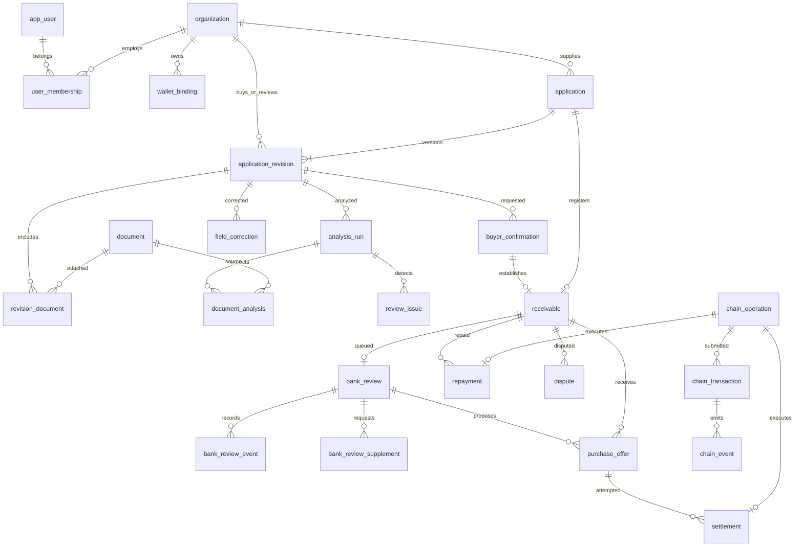
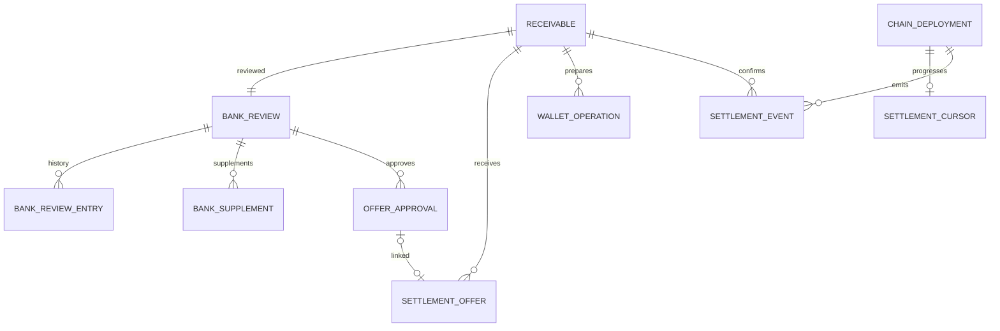

# PaidAhead ERD — v1 설계안

작성일: 2026-09-19. 구현 전 데이터 설계이며, 실행 가능한 마이그레이션은 아니다.

근거: [기능명세서](PaidAhead_기능명세서_v1.md), [랜딩·제안 문서](landing.md), [제안 요약서 및 기술 스택](proposal_digest.md).

## 1. 범위와 저장소

Next.js·TypeScript 화면과 Node.js 서버가 사용하는 **PostgreSQL 업무 모델**을 중심으로 설계한다. 파일은 비공개 객체 저장소에, 자산 소유권과 결제 결과는 Injective EVM 테스트넷의 Solidity 계약에 저장한다. Hardhat은 계약 검증에, viem은 읽기·서명·영수증·이벤트 연동에 사용한다. ORM과 인증 제공자는 아직 선택하지 않는다.

| 저장 위치 | 저장할 데이터 | 기준 원장 |
|---|---|---|
| PostgreSQL | 조직·권한, 신청 버전, AI 결과·수정, 구매처 확인, 은행 검토, 분쟁 | 업무 판단·문서 접근권한 |
| 비공개 객체 저장소 | 원문·보완·분쟁 증빙 | 원본 파일, DB에는 키·해시·메타데이터 |
| 스마트계약 | 채권 식별자, 확인 스냅샷 해시, 금액·만기, 지정 지갑, 소유자, 제안, 매입·상환 결과 | 자산·결제 상태 |
| PostgreSQL 체인 동기화 테이블 | 거래 시도, 영수증, 이벤트, 체인 상태 사본 | 조회·장애 복구용. 계약 결과를 임의로 덮어쓰지 않음 |

v1은 지정 은행 역할 1곳, 채권당 매입 1회, 전액 상환 1회다. 제안 요약서의 월 구독·분할 매입·보증·복수 기관은 향후 확장으로 분리하고 이번 ERD에 넣지 않는다. 실제 은행 계좌·원화 송금·자동 신용평가도 제외한다.

## 2. 핵심 관계도

전체 업무 흐름을 보여 주는 축약도다. 상세 필드와 보조 테이블은 뒤에서 정의한다. `||`는 정확히 하나, `o|`는 0 또는 1, `o{`는 0개 이상이다.



구매처(`buyer_org_id`)는 납품을 받고 지급 의무를 지는 조직이며, 채권을 매입하는 은행(`bank_org_id`)과 구분한다. 매입 측 지갑은 `bank_wallet_id`로 명명한다.

## 3. 자료형과 공통 규칙

- 일반 PK는 `uuid`, 생성·수정·업무 시각은 `timestamptz`를 사용한다. 저장은 절대 시각, 화면은 Asia/Seoul 기준이다. 만기 날짜를 정확한 시각으로 변환하는 정책은 별도로 확정한다.
- 아래 필드 목록의 `?`는 NULL 허용, `→`는 FK다. 모든 테이블은 별도 표시가 없으면 `id uuid PK`, `created_at`을 가진다. 변경 가능한 업무 행에는 `updated_at`과 동시성 제어용 `lock_version integer`를 둔다.
- 원화 금액은 `bigint`, 통화는 `char(3)`이며 v1은 KRW다. 온체인 정수·토큰 ID는 `numeric(78,0)`으로 저장하고 uint256 범위를 검증한다. 금액에 float를 사용하지 않는다.
- TypeScript API에서 bigint·numeric 값은 10진수 문자열로 전달하고 viem 경계에서 `bigint`로 변환한다.
- EVM 주소는 정규화된 `0x`+40자리 `varchar(42)`, 체인 해시는 `0x`+64자리 `varchar(66)`로 저장한다. 파일 해시와 스냅샷 해시는 알고리즘·직렬화 버전을 명시한다.
- FK 대상 업무 자료는 원칙적으로 `ON DELETE RESTRICT`. 탈퇴·권한 해제·취소는 상태 변경이며 거래 이력을 연쇄 삭제하지 않는다. 파일 보관·삭제 정책은 별도 결정한다.

## 4. 참여자와 권한

| 테이블 | 주요 필드 | 제약·용도 |
|---|---|---|
| `app_user` | `auth_provider`, `auth_subject`, `display_name`, `status` | UNIQUE(provider, subject). 인증 제공자의 사용자와 연결 |
| `organization` | `name`, `display_name`, `kind`, `approval_status`, `is_demo`, `approved_by? → app_user`, `approved_at?` | kind: SUPPLIER / BUYER / BANK / PLATFORM. 이름으로 권한 부여 금지 |
| `user_membership` | `user_id → app_user`, `organization_id → organization`, `status` | UNIQUE(user_id, organization_id) |
| `membership_role` | `membership_id → user_membership`, `role` | UNIQUE(membership_id, role). SUPPLIER_OPERATOR / BUYER_CONFIRMER / BANK_REVIEWER / BANK_APPROVER / ADMIN 등 복수 역할 가능 |
| `wallet_binding` | `organization_id → organization`, `chain_id`, `address`, `verification_status`, `verified_at?`, `approved_by? → app_user`, `approved_at?`, `revoked_at?` | UNIQUE(chain_id, address). v1에서 지갑의 조직 변경 금지, 해제해도 행 유지 |
| `wallet_permission` | `wallet_id → wallet_binding`, `permission`, `desired_status`, `effective_status`, `last_operation_id? → chain_operation` | UNIQUE(wallet_id, permission). SUPPLIER / PAYER / BANK_PURCHASER / REGISTRAR. 서버 승인과 체인 권한 반영 구분 |
| `audit_log` | `actor_id? → app_user`, `actor_kind`, `organization_id? → organization`, `action`, `target_type`, `target_id`, `previous_value? jsonb`, `new_value? jsonb`, `reason?`, `request_id` | 추가만 허용. 시스템 행위도 actor_kind=SYSTEM으로 기록 |

감사 대상 `target_type/target_id`는 여러 테이블을 가리키는 감사용 참조이며 DB FK가 아니다. 필수 업무 관계는 각 테이블의 실제 FK로 보장한다. 감사값에 문서 원문·서명키·비밀정보를 복제하지 않는다. 은행 내부 판단 감사 로그는 은행 전용 접근 범위를 상속한다.

## 5. 신청·문서·AI 검토

| 테이블 | 주요 필드 | 제약·용도 |
|---|---|---|
| `application` | `supplier_org_id → organization`, `current_revision_id → application_revision`, `created_by → app_user` | 신청의 고정 식별자. 현재 버전 FK는 동일 신청의 버전만 허용 |
| `application_revision` | `application_id → application`, `version`, `buyer_org_id → organization`, `target_bank_org_id → organization`, `trade_reference`, `title`, `status`, `confirmed_amount?`, `currency`, `confirmed_due_at?`, `confirmed_fields jsonb`, `selected_analysis_run_id? → analysis_run`, `review_completed_by? → app_user`, `review_completed_at?`, `consented_by? → app_user`, `consent_version?`, `submission_consent_at?`, `snapshot_hash?`, `snapshot_schema_version`, `frozen_at?` | UNIQUE(application_id, version). 거래처·금액·만기·은행 지정도 버전별 보존 |
| `document` | `owner_org_id → organization`, `purpose`, `original_filename`, `storage_key`, `mime_type`, `file_size`, `file_hash`, `uploaded_by → app_user`, `uploaded_at` | UNIQUE(storage_key), file_size > 0. purpose: APPLICATION / SUPPLEMENT / DISPUTE. 파일은 불변 |
| `revision_document` | `revision_id → application_revision`, `document_id → document`, `document_type` | UNIQUE(revision_id, document_id). 동일 파일을 새 버전에 참조 가능; 기존 파일 덮어쓰기 금지 |
| `analysis_run` | `revision_id → application_revision`, `run_no`, `idempotency_key`, `input_manifest_hash`, `status`, `model_version`, `prompt_version`, `schema_version`, `error_code?`, `started_at?`, `completed_at?` | UNIQUE(revision_id, run_no), UNIQUE(idempotency_key). 버전 전체 비교 작업 단위 |
| `document_analysis` | `run_id → analysis_run`, `document_id → document`, `status`, `extracted_fields jsonb`, `field_evidence jsonb`, `error_code?`, `started_at?`, `completed_at?` | UNIQUE(run_id, document_id). 분석 대상은 해당 run의 버전에 연결된 파일만 허용 |
| `review_issue` | `run_id → analysis_run`, `field_path`, `issue_type`, `compared_values jsonb`, `reason`, `resolution_status`, `resolution_note?`, `resolved_by? → app_user`, `resolved_at?` | 누락 / 판독 불가 / 충돌 구분. 재분석 결과는 이전 run과 분리 |
| `field_correction` | `revision_id → application_revision`, `source_analysis_id? → document_analysis`, `field_path`, `original_value jsonb`, `corrected_value jsonb`, `reason`, `corrected_by → app_user`, `corrected_at` | 추가만 허용. AI 원본 결과는 수정하지 않음 |

`confirmed_fields`에는 품목·수량 등 최종 확인 세부값을 저장한다. 검색·검증에 필요한 금액·만기는 정형 컬럼을 기준으로 삼고 JSON과 이중으로 수정하지 않는다. `field_evidence`는 필드별 문서 ID·페이지·인용문·선택적 좌표·근거 없음 표시를 담는 검증된 JSON 스키마다.

스냅샷은 버전의 조직 ID, 거래 식별정보, 금액·통화·만기, 품목, 파일 해시 목록, 선택한 분석·검토 결과, 동의 버전을 정해진 직렬화 방식으로 묶는다. 구매처 확인 요청부터 동결한다. 변경 시 새 revision을 생성하고 이전 요청·확인을 무효화한다. 등록 이후에는 원래 revision을 변경하지 않는다.

새 분석 결과가 과거 버전에 늦게 도착해도 현재 버전·선택 run을 바꾸지 않는다. `current_revision_id`와 `selected_analysis_run_id`는 같은 부모에 속하는지 복합 FK 또는 트리거로 보장한다. 최초 신청·버전 생성의 순환 FK는 한 트랜잭션의 지연 검사 FK로 처리한다.

## 6. 구매처 확인·채권

| 테이블 | 주요 필드 | 제약·용도 |
|---|---|---|
| `buyer_confirmation` | `revision_id → application_revision`, `buyer_org_id → organization`, `snapshot_hash`, `status`, `requested_by → app_user`, `requested_at`, `confirmed_by? → app_user`, `confirmed_at?`, `delivery_acknowledged`, `payment_obligation_acknowledged`, `rejected_by? → app_user`, `rejected_at?`, `rejection_reason?`, `withdrawn_at?`, `invalidated_at?` | 같은 revision의 유효 요청·확인은 최대 1개. 확인·철회·무효화는 감사 기록 |
| `receivable` | `application_id → application`, `revision_id → application_revision`, `confirmation_id → buyer_confirmation`, `unique_trade_key`, `snapshot_hash`, `confirmation_reference_hash`, `supplier_org_id → organization`, `buyer_org_id → organization`, `supplier_wallet_id → wallet_binding`, `payer_wallet_id → wallet_binding`, `holder_wallet_id? → wallet_binding`, `face_amount`, `currency`, `due_at`, `deployment_id → chain_deployment`, `token_id?`, `chain_status?`, `registered_at?`, `last_event_id? → chain_event`, `synced_at?` | UNIQUE(application_id), UNIQUE(confirmation_id), UNIQUE(unique_trade_key), UNIQUE(deployment_id, token_id) |

`receivable`은 등록 예정 예약 행을 먼저 생성해 계약에 전달할 고정 ID와 중복 방지 키를 확보한다. 등록 전 `chain_status`·`token_id`·`holder_wallet_id`는 NULL이며 등록 작업 상태는 `chain_operation`으로 관리한다. 은행 매입 가능 목록에는 `chain_status=REGISTERED`인 확정 행만 표시한다.

`unique_trade_key`는 임시안으로 납품업체 ID·구매처 ID·정규화한 거래번호에서 생성한다. 같은 키의 중복 예약·등록과 취소 후 재사용을 금지한다. 거래번호 정규화·복수 청구 식별 정책은 미정이며, 다른 번호로 제출한 동일 거래나 외부 시스템의 중복까지 막지는 못한다. 원문 거래번호는 온체인에 보내지 않는다.

DB에서 revision→application, confirmation→revision의 일치를 복합 FK로 보장한다. 등록 전 최신 버전, 확인 완료, 해시 일치, 승인 역할·지갑, 미래 만기, 양수 금액을 같은 잠금 안에서 재검증한다. 등록 준비 후 결과 확정까지 해당 버전 변경을 잠가 등록과 확인 무효화의 경합을 막는다.

## 7. 銀行審査・提案・決済・返済

| 테이블 | 주요 필드 | 제약·용도 |
|---|---|---|
| `bank_review` | `receivable_id → receivable`, `bank_org_id → organization`, `assigned_reviewer_id? → app_user`, `review_version`, `reviewed_snapshot_hash`, `status`, `internal_note?`, `public_message?`, `approved_by? → app_user`, `approved_at?` | UNIQUE(receivable_id). 지정 은행 1곳의 검토 건. 재검토 이력은 event에 누적 |
| `bank_review_event` | `review_id → bank_review`, `review_version`, `actor_id → app_user`, `action`, `previous_status?`, `new_status`, `internal_note?`, `public_message?`, `reviewed_snapshot_hash` | 추가만 허용. 조건 승인은 독립 event로 보존 |
| `bank_review_supplement` | `review_id → bank_review`, `requested_by → app_user`, `public_request`, `submitted_by? → app_user`, `response_text?`, `status`, `requested_at`, `submitted_at?`, `closed_at?` | 보완 요청별 한 행, 후속 요청은 새 행 |
| `supplement_document` | `supplement_id → bank_review_supplement`, `document_id → document` | UNIQUE(supplement_id, document_id). 기존 채권 스냅샷과 별개 |
| `purchase_offer` | `receivable_id → receivable`, `bank_review_id → bank_review`, `approval_event_id → bank_review_event`, `bank_org_id → organization`, `bank_wallet_id → wallet_binding`, `purchase_amount`, `payment_token_id → payment_token`, `amount_raw`, `expires_at`, `status`, `onchain_offer_id?`, `created_onchain_at?`, `withdrawn_at?`, `last_event_id? → chain_event` | 승인 당시 event와 정확히 연결. 같은 채권의 ACTIVE는 최대 1개 |
| `settlement` | `receivable_id → receivable`, `offer_id → purchase_offer`, `operation_id → chain_operation`, `seller_wallet_id → wallet_binding`, `bank_wallet_id → wallet_binding`, `payment_token_id → payment_token`, `payment_amount`, `amount_raw`, `confirmed_at?`, `confirmation_event_id? → chain_event` | UNIQUE(operation_id), 성공한 settlement는 채권당 최대 1개 |
| `repayment` | `receivable_id → receivable`, `operation_id → chain_operation`, `payer_wallet_id → wallet_binding`, `recipient_wallet_id → wallet_binding`, `payment_token_id → payment_token`, `amount`, `amount_raw`, `due_at`, `paid_at?`, `confirmation_event_id? → chain_event` | UNIQUE(operation_id), 성공한 repayment는 채권당 최대 1개 |
| `dispute` | `receivable_id → receivable`, `opened_by → app_user`, `reason`, `status`, `resolution_note?`, `reviewed_by? → app_user`, `opened_at`, `resolved_at?` | 채권 상태와 독립. 분쟁만으로 상환 차단·소유권 역전 없음 |
| `dispute_document` | `dispute_id → dispute`, `document_id → document` | UNIQUE(dispute_id, document_id) |

제안은 `purchase_offer.status=DRAFT`로 생성하고 성공 이벤트 수신 후 ACTIVE로 바꾼다. 철회 요청만으로 WITHDRAWN 처리하지 않는다. 조건 변경은 기존 제안 철회 확정 후 새 제안을 만드는 방식이다. 만료 여부는 `expires_at`으로도 검사해 상태 갱신 작업 지연에 의존하지 않는다.

성공한 settlement / repayment는 각각 `confirmed_at IS NOT NULL` / `paid_at IS NOT NULL` 조건의 부분 UNIQUE로 제한한다. 실패·서명 거절 후 새 시도는 별도 행으로 기록하지만, 결과 불명 상태에서는 새 업무 작업을 만들지 않는다. 같은 체인 작업의 가스 대체 거래는 `chain_transaction` 추가로 표현한다.

결제액은 제안 매입 금액이고 상환액은 액면 전액이다. 상환 수취인은 실행 시점의 보유 은행 지갑이다. 은행의 신규 매입 권한을 해제해도 기존 채권 수취 권리는 유지한다. 각 기록의 지갑·금액은 거래 시점 값으로 고정한다.

## 8. 체인 작업·이벤트 동기화

| 테이블 | 주요 필드 | 제약·용도 |
|---|---|---|
| `chain_deployment` | `chain_id`, `receivable_contract`, `settlement_contract`, `deployment_block`, `environment`, `active` | UNIQUE(chain_id, receivable_contract). 체인·배포를 명시적으로 구분 |
| `payment_token` | `chain_id`, `address`, `symbol`, `decimals`, `is_mock`, `enabled` | UNIQUE(chain_id, address). 소수 자릿수·주소는 사용 후 불변 |
| `chain_operation` | `deployment_id → chain_deployment`, `kind`, `receivable_id? → receivable`, `offer_id? → purchase_offer`, `wallet_permission_id? → wallet_permission`, `requested_by? → app_user`, `idempotency_key`, `status`, `expected_snapshot_hash?`, `request_payload jsonb`, `failure_code?`, `failure_reason?`, `confirmed_at?` | UNIQUE(idempotency_key). REGISTER / CANCEL / CREATE_OFFER / WITHDRAW_OFFER / SETTLE / REPAY / GRANT_ROLE / REVOKE_ROLE |
| `chain_transaction` | `operation_id → chain_operation`, `chain_id`, `tx_hash`, `sender_address`, `nonce`, `replaces_transaction_id? → chain_transaction`, `status`, `submitted_at`, `receipt_status?`, `block_number?`, `block_hash?`, `confirmed_at?`, `error_code?` | UNIQUE(chain_id, tx_hash). 한 작업에 원거래·가스 대체거래 등 복수 제출 가능 |
| `chain_event` | `deployment_id → chain_deployment`, `transaction_id? → chain_transaction`, `chain_id`, `contract_address`, `tx_hash`, `log_index`, `block_number`, `block_hash`, `event_type`, `payload jsonb`, `canonical`, `processed_at?` | UNIQUE(chain_id, tx_hash, log_index). 서버가 제출하지 않은 거래 이벤트도 수집 |
| `chain_sync_cursor` | `deployment_id → chain_deployment`, `contract_address`, `last_processed_block`, `last_processed_block_hash`, `updated_at` | UNIQUE(deployment_id, contract_address). 재시작 시 안전 구간부터 재조회 |

작업 kind별 필수 FK·허용 NULL 조합은 CHECK로, offer와 receivable 일치 등 다른 행의 관계는 복합 FK/트리거로 검증한다. 등록·취소·제안·권한 변경도 결제·상환과 동일한 실패 복구 모델을 사용한다.

1. DB 트랜잭션에서 업무 조건 검사 후 멱등키로 작업을 생성한다. 같은 요청을 다시 받으면 기존 작업을 반환한다. 이 작업 테이블을 재처리 가능한 작업 큐로 사용한다.
2. 서명 대기·제출·확정 대기를 구분한다. 트랜잭션 해시를 받으면 저장한다. 서명키는 DB·AI 요청에 보관하지 않는다.
3. 성공 영수증과 예상 계약의 이벤트, 채권·제안 ID를 검증한 뒤 확정 정책을 적용한다. 오류·시간 초과만으로 실패 판정하지 않는다.
4. 하나의 DB 트랜잭션에서 이벤트 중복 검사, 채권·제안·결제 상태 반영, 작업 확정, `processed_at` 갱신을 처리한다. 중간 실패 시 전부 롤백한다.
5. 체인 성공 후 응답 유실은 이벤트 재수집과 계약 조회로 복구한다. 같은 채권을 새로 발행하지 않는다.
6. 재구성 감지 시 블록 해시를 검증하고 `canonical=false`로 표시한 이벤트의 투영을 재계산한다. 같은 이벤트 키가 새 블록으로 이동하면 블록 메타데이터를 갱신 후 다시 검증한다. 확인 수·최종성 기준은 운영 정책으로 확정한다.

`chain_operation`과 거래 상태가 작업 상태의 기준이며 settlement/repayment에 별도 가변 status를 중복 저장하지 않는다. 화면 상태는 JOIN 또는 뷰로 제공한다. 성공 시각·금액·참여 지갑은 이력 조회용 확정 자료다.

## 9. 상태와 전이

| 대상 | 상태 |
|---|---|
| 신청 버전 | DRAFT / ANALYZING / REVIEW_REQUIRED / REVIEW_COMPLETED / ANALYSIS_FAILED |
| AI 작업·문서 분석 | QUEUED / PROCESSING / SUCCEEDED / FAILED |
| 불일치 | OPEN / RESOLVED |
| 구매처 확인 | PENDING / CONFIRMED / REJECTED / WITHDRAWN / INVALIDATED |
| 채권 체인 상태 | 등록 전 NULL → REGISTERED → PURCHASED → REPAID, 또는 REGISTERED → CANCELLED |
| 은행 검토 | PENDING / IN_REVIEW / NEEDS_INFO / APPROVED_FOR_OFFER / DECLINED |
| 보완 | REQUESTED / SUBMITTED / CLOSED |
| 제안 | DRAFT / ACTIVE / WITHDRAWN / EXPIRED / ACCEPTED / INVALIDATED |
| 체인 업무 작업 | NOT_SUBMITTED / AWAITING_SIGNATURE / PENDING / CONFIRMED / FAILED / USER_REJECTED |
| 체인 거래 | PENDING / CONFIRMED / REVERTED / REPLACED / DROPPED |
| 분쟁 | OPEN / UNDER_REVIEW / RESOLVED |

연체는 별도 채권 상태가 아니다. 현재 연체는 `chain_status = PURCHASED AND due_at < now()`로 계산한다. 상환 후에도 `paid_at > due_at`로 지연 상환 이력을 조회한다. 미매입 채권의 만기 경과는 매입 불가로만 표시한다. 분쟁 존재 여부도 열린 dispute를 조회해 별도 배지로 표시한다.

## 10. 핵심 제약과 인덱스

| 규칙 | DB·서버 처리 | 계약 처리 |
|---|---|---|
| 확인 대상 불변 | revision 동결, confirmation hash 일치, 최신 버전 검사 | 등록 권한·확인 참조 hash 저장 |
| 중복 등록 금지 | unique_trade_key 영구 UNIQUE, application당 receivable 1개 | 사용한 식별자 재사용 금지 |
| 유효 제안 1개 | receivable별 ACTIVE 부분 UNIQUE, 생성 작업 예약 잠금 | 채권별 활성 제안 ID |
| 중복 매입·상환 금지 | 성공 시각 존재 행의 receivable 부분 UNIQUE, 처리 중 작업 예약 | 상태·소유권 검사, 성공 1회 |
| 매입 취소 경쟁 | 같은 채권 행 잠금 및 lock_version 검사 | 체인 실행 순서에 따라 하나만 성공 |
| 지급·채권 원자 교환 | 성공 이벤트 뒤에만 DB 반영 | 두 자산 이전이 단일 트랜잭션 |
| 승인 은행만 거래 | 조직·membership·approval event·지갑 관계 검사 | 현재 BANK_PURCHASER 권한 검사 |
| 금액·토큰 일치 | 양수, 동일 chain, 허용 토큰, raw 변환 검증 | 금액·토큰·잔액·allowance 재검사 |

제안 금액은 임시 기본안으로 `0 < purchase_amount <= face_amount`, `expires_at < due_at`를 적용한다. 문서의 미정 정책이므로 확정 전 실제 금융 조건으로 취급하지 않는다. 모의 토큰 1개를 1원에 대응시키므로 `amount_raw = 원화정수 × 10^decimals`다. v1에서는 지정 모의 토큰 한 종류를 매입과 상환에 공통 사용한다.

부분 UNIQUE 예시:

```sql
CREATE UNIQUE INDEX uq_live_confirmation
ON buyer_confirmation (revision_id)
WHERE status IN ('PENDING', 'CONFIRMED');

CREATE UNIQUE INDEX uq_active_offer
ON purchase_offer (receivable_id) WHERE status = 'ACTIVE';

CREATE UNIQUE INDEX uq_confirmed_settlement
ON settlement (receivable_id) WHERE confirmed_at IS NOT NULL;

CREATE UNIQUE INDEX uq_confirmed_repayment
ON repayment (receivable_id) WHERE paid_at IS NOT NULL;
```

추가 조회 인덱스는 FK 컬럼과 `application(supplier_org_id, created_at)`, `application_revision(buyer_org_id, created_at)`, `buyer_confirmation(buyer_org_id, status, requested_at)`, `bank_review(bank_org_id, status, created_at)`, `receivable(holder_wallet_id, chain_status, due_at)`, `chain_operation(status, created_at)`, `chain_event(deployment_id, block_number, log_index)`를 우선한다. 시간에 따라 변하는 now()는 부분 인덱스 조건으로 넣지 않는다.

## 11. 접근 제어와 조회 모델

- 납품업체: 본인 조직의 신청·채권·공개 검토 결과만 조회한다.
- 구매처: 자신에게 지정된 확인 요청과 관련 채권·상환만 조회한다.
- 은행: 지정 검토 건과 보유 채권만 조회한다. 내부 메모·검토 event 전체는 은행 전용 API로 제공한다. 업체 공개 API는 public_message를 명시적으로 선택한다.
- 관리자: 조직 승인·예외·분쟁 처리 권한을 분리한다. 관리자라는 이유만으로 등록 지갑 권한을 부여하지 않는다.
- 파일: 접근 가능한 업무 관계를 검증한 뒤 짧은 만료의 다운로드 URL을 발급한다. storage_key 자체는 접근 권한이 아니다.
- 서버에서 조직 범위를 강제하며 PostgreSQL RLS는 보조 방어로 적용할 수 있다. 브라우저가 DB에 직접 연결하지 않는다.

사장님 진행 화면은 신청 검토 + 구매처 확인 + 등록 작업 + 은행 검토 + 제안 + 결제 작업을 조합한 뷰로 만든다. 단일 status에 모든 단계를 넣지 않는다. 은행 이력은 같은 receivable을 기준으로 AI 근거·구매처 확인·승인 event·체인 event를 연결한다.

## 12. 시연 데이터와 검증 기준

가상 납품업체·구매처·은행 조직 각 1개, 역할별 사용자·승인 지갑을 준비한다. 신청 v1에 발주서·납품서·청구서를 연결하고 AI 분석과 보완을 완료한다. 구매처는 3,000,000원·30일 뒤 만기를 포함한 동결 버전을 확인한다. 등록 성공 이벤트로 채권과 은행 검토 건을 연결하고, 승인 event에 연결된 2,970,000원 제안을 생성한다. 매입 완료 이벤트에서 보유자를 은행으로 변경하고, 구매처의 3,000,000원 전액 상환 이벤트에서 REPAID로 변경한다.

구현 시 다음을 검증한다: 이전 버전 확인으로 등록 차단, 중복 이벤트 멱등 반영, 동일 조건 중복 수락 성공 1회, 잔액 부족 시 양측 불변, 취소 식별자 재사용 차단, 상환 실패 후 재시도, 처리 시간 초과 후 중복 제출 차단, 은행 내부 메모 비공개, 연체 후 상환 이력 보존. 이 문서 작성 단계에서는 실행 검증을 수행한 것으로 간주하지 않는다.

구현 전에 확정할 항목은 거래 식별 키 규칙, 만기 기준 시각, 구매처 확인 만료, 문서 보관 기간, 은행 승인자 분리, 재검토·정정 정책, 모의 토큰 decimals, 체인 최종성·재동기화 기준이다. 구매처 확인은 기능명세서의 계정 확인 + 별도 등록자 방식으로 설계했으며 직접 지갑 서명 방식은 이후 확장이다.

## 구현 반영: 은행·매입·상환

위 ERD는 목표 설계다. 현재 실행 스키마는 `packages/database/migrations/001_confirmation.sql`부터 `003_settlement.sql`까지를 기준으로 한다. 아래는 프론트 연결 전 구현된 결제 관계다.



- `bank_review`: 검토 버전·검토자·비공개 메모·공개 결과. `bank_review_entry`는 은행 전용 append-only 업무 이력이다.
- `bank_supplement`: REQUESTED → SUBMITTED → CLOSED. 등록 스냅샷을 변경하지 않는 추가 설명이다.
- `offer_approval`: 스냅샷·금액·만료·은행 지갑·승인자와 불변 참조 해시. 실제 온체인 오퍼와 별도다.
- `settlement_offer`: 배포+온체인 offer_id 유일. 검증된 승인과만 연결하며 외부 직접 실행은 approval_id가 null일 수 있다.
- `wallet_operation`: 조직+idempotency_key 유일. 지갑용 calldata·발신자·지급 토큰 승인 payload와 결과를 저장한다. 개인키와 서명 원문은 저장하지 않는다. 보고된 tx_hash는 검증 전 주장일 뿐이다.
- `settlement_event`: 배포+tx_hash+log_index 유일. 매입·상환·취소·오퍼 상태의 원장 근거다. 매입·상환 상세는 이벤트 payload와 `receivable`의 hash·시각 컬럼으로 구현했다.
- `settlement_cursor`: 원자적 반영 마지막 블록 번호·해시. 등록 경로의 `chain_operation`·`chain_transaction`·`chain_event`와 별도로 관리한다.

AI·실제 인증·추가 파일 저장·분쟁 모델 등 목표 설계의 모든 테이블을 구현한 것은 아니다.
